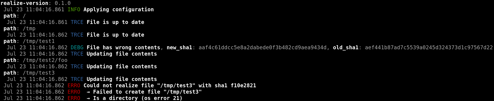

# `realize` [](https://crates.io/crates/realize) [](https://docs.rs/realize)

`realize` is a blazingly fast configuration management library written in Rust.
It exposes a type-safe eDSL for writing system configuration programs.

# Features

The goal of `realize` is to allow you to write flexible system configurations
using the full power of Rust. You can then deploy this configuration to any
other machine as a statically linked executable and run it to apply needed
changes without having to install any other dependencies.

This is different from other similar configuration management tools such as
Ansible, Puppet or Chef, which have significant system dependencies, and
interpret the configuration on the target machine in a dynamic way, which can
lead to errors that a type system can alleviate.

# Example

Here is an example `realize` configuration (see the `examples` directory for
more):

```rust
extern crate realize;

use realize::fs;

fn main() {
    realize::apply(configuration)
}

fn configuration(reality: &mut realize::Reality) {
    reality.ensure(fs::File::at("/etc/hostname").contains_str("dflemstr-desktop"));
    // Include the ’files/etc/passwd’ file in the static binary so that the
    // configuration is truly dependency-free
    reality.ensure(fs::File::at("/etc/passwd").contains_str(include_str!("files/etc/passwd")));
}
```

Example output (not from the above example, but another one):



# Getting started

[Install Rust](https://www.rust-lang.org/install.html) (only needed on your
development machine) and then create a new crate for your configuration:

    $ cargo new --bin myconfig
    $ cd myconfig
    
Now, declare a dependency on `realize` in your `Cargo.toml` file:

    [dependencies]
    realize = "*"

You’re now ready to put your configuration in `src/main.rs`.  To apply the configuration locally, just run:

    $ cargo run

To get a binary that can be deployed elsewhere, build a release binary:

    $ cargo build --release

The resulting binary is in `target/release/myconfig`.

This binary still depends on your operating system’s LIBC version. To get a
truly dependency free binary, first install [musl](https://www.musl-libc.org/)
using your operating system’s package manager, then cross compile the binary to
musl:

    $ rustup target add x86_64-unknown-linux-musl
    $ cargo build --release --target x86_64-unknown-linux-musl
